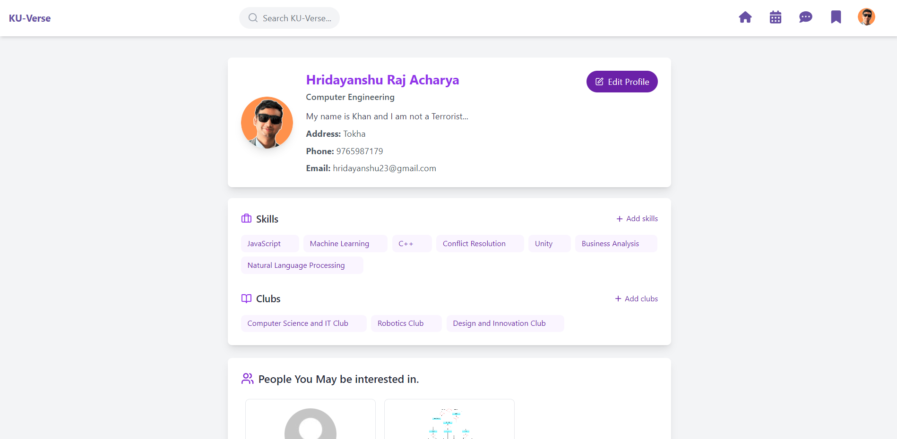
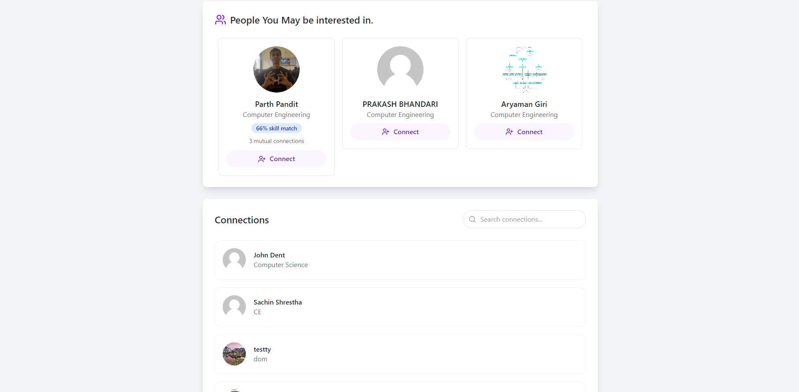
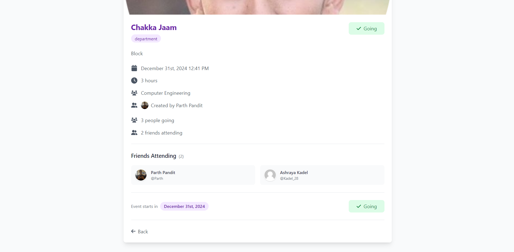
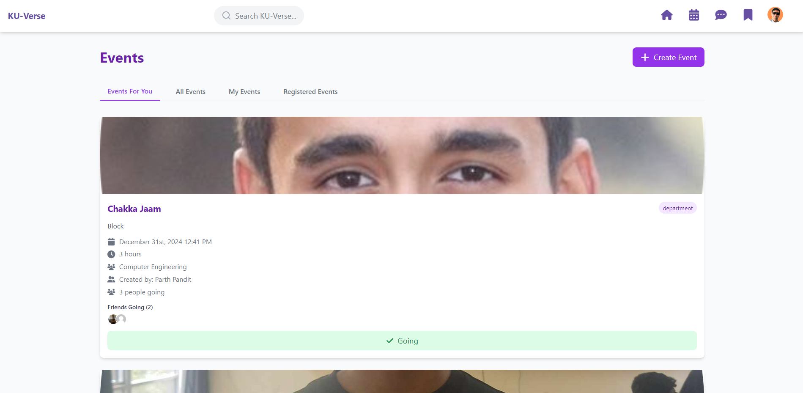
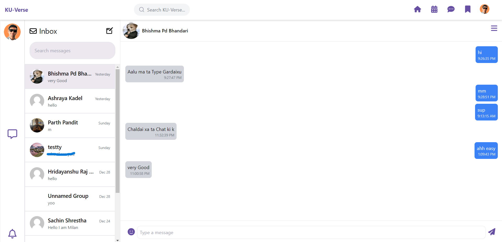
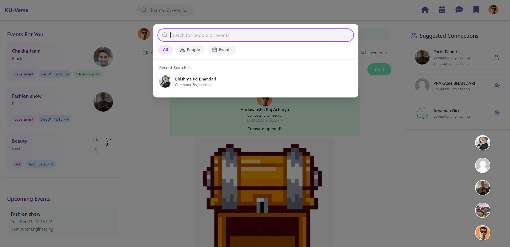
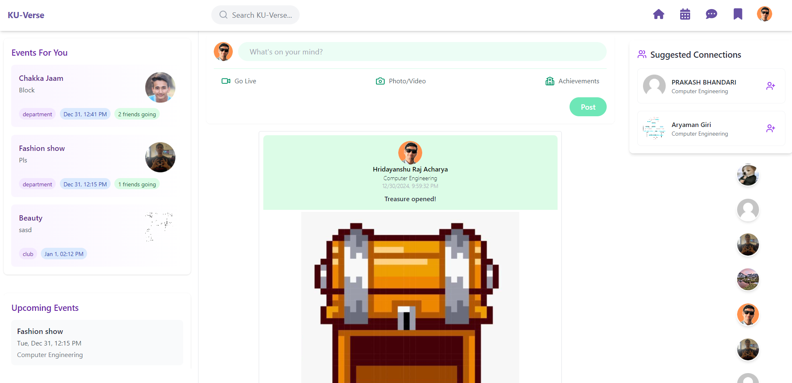
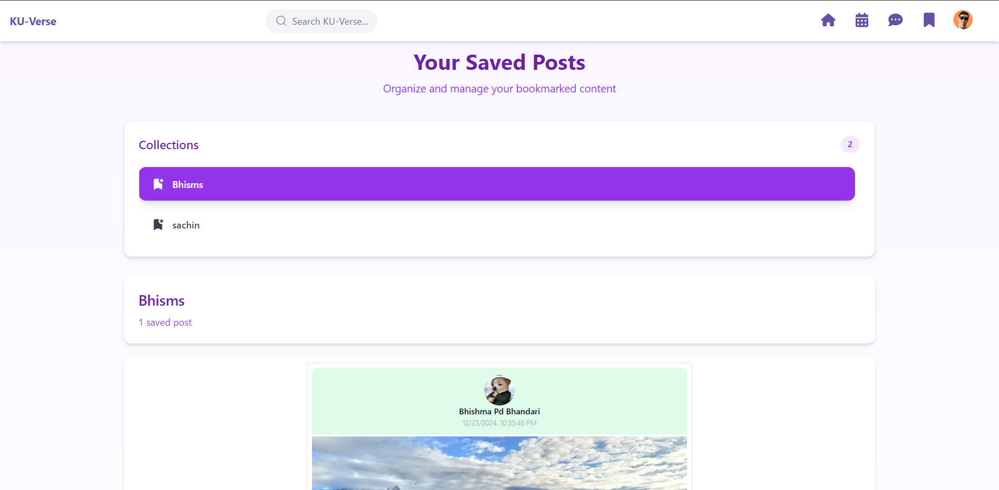

# KU_Verse

KU_Verse is a MERN Stack social media application designed specifically for the students of Kathmandu University. Our platform aims to fill the gap by offering a dedicated space for university-centric interactions, serving as a central hub for various university-related events and networking.

## Features

- **University-Centric Interactions:** Connect with peers from Kathmandu University.
- **Event Hub:** Centralized platform for various university-related events.
- **Networking:** Helps students connect with peers based on matched interests, mutual friends, mutual skills, department, and club.
- **Chat:** Real-time chat with connections.
- **Posts:** Share pictures and thoughts.
- **Recommendations:** Get user recommendations based on interests, mutual friends, skills, department, and club.

## Tech Stack

- **Frontend:**
  - React
  - Tailwind CSS
- **Backend:**
  - Node.js
  - Express.js
- **Database:**
  - MongoDB
- **Authentication:**
  - JWT (JSON Web Tokens)
- **Image Storage:**
  - Cloudinary

## Getting Started

### Prerequisites

- [Node.js](https://nodejs.org/)
- [MongoDB](https://www.mongodb.com/)

### Installation

1. Clone the repository:
    ```bash
    git clone https://github.com/hridayanshu236/KU_Verse.git
    cd KU_Verse
    ```

2. Install dependencies:
    ```bash
    npm install
    ```

3. Set up environment variables:
    - Create a `.env` file in the root directory.
    - Add the necessary environment variables (e.g., MongoDB URI, JWT secret, Cloudinary credentials).

4. Start the development server:
    ```bash
    npm run dev
    ```

## Folder Structure

- **frontend/**: Contains the React frontend code.
- **backend/**: Contains the Node.js/Express backend code.
- **models/**: Mongoose models for MongoDB.
- **routes/**: API routes.
- **controllers/**: Request handlers.
- **middlewares/**: Custom middleware functions.

## Screenshots

### Profile Page


### Profile Page 


### Events Page


### Events List


### Chat Interface


### Search Interface


### Feed Page


### Bookmarks


## Contributing

We welcome contributions! Please read our [Contributing Guidelines](CONTRIBUTING.md) for more information.

## License

This project is licensed under the [MIT License](LICENSE).

## Contact

For any inquiries or issues, please contact us at kuverse6699@gmail.com.

## Team Members

This project was developed as part of a 4th semester engineering project by the following team members:

- [Hridayanshu Raj Acharya](https://github.com/hridayanshu236)
- [Bhishm Pd. Bhandari](https://github.com/DontHash)
- [Ashraya Kadel](https://github.com/kadel-28)
- [Parth Pandit](https://github.com/ParthPandit45)
- [Sachin Shrestha](https://github.com/SachinSrestha)

You can find more information about the team members in the [Contributors](https://github.com/hridayanshu236/KU_Verse/graphs/contributors) section of the repository.
