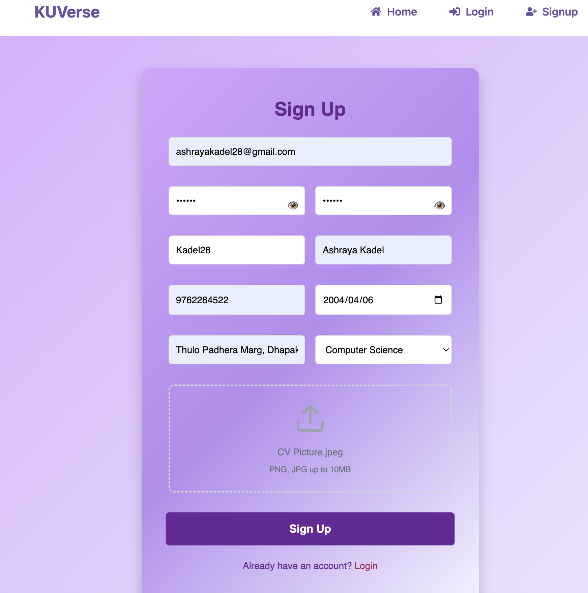
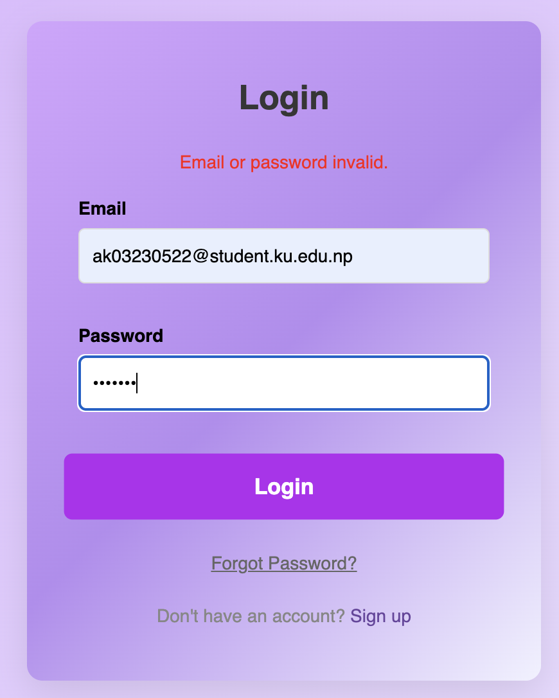

# 🐞 KUVerse — Defect Log

> **Project:** KUVerse  
> **Testing Approach:** Manual Testing  
> **Defect Status:** The defects listed below are **Open / Unresolved** because the identified defects have not been fixed.  
> **Source:** TestCases.xlsx, TestPlan.md, and TestScenarios.md

## Defect Summary

| Defect ID | Related Test Case | Scenario | Priority | Severity | Status |
|---|---|---|---|---|---|
| DID-S1-001 | TC-S1-002 | S1 | High | Low | **Open / Unresolved** |
| DID-S1-002 | TC-S1-006 | S1 | High | Low | **Open / Unresolved** |
| DID-S3-001 | TC-S3-008 | S3 | High | Medium | **Open / Unresolved** |
| DID-S5-001 | TC-S5-002 | S5 | Medium | High | **Open / Unresolved** |
| DID-S5-002 | TC-S5-005 | S5 | Medium | High | **Open / Unresolved** |
| DID-S9-001 | TC-S9-001 | S9 | High | High | **Open / Unresolved** |
| DID-S9-002 | TC-S9-002 | S9 | High | Medium | **Open / Unresolved** |

---

## Defect Details

### DID-S1-001 — Verify signup with invalid or incomplete information

- **Scenario ID:** S1
- **Test Case ID:** TC-S1-002
- **Priority:** High
- **Severity:** Low
- **Environment:** Local development environment
- **Executed By:** Ashraya Kadel
- **Execution Date:** 2024-10-02
- **Status:** **Open / Unresolved**

#### Description / Observed Issue
Although sign-up was rejected, clear validation feedback was not displayed.

#### Steps to Reproduce
Submit signup with one or more required fields missing or invalid.

#### Expected Result
Signup is rejected and clear validation feedback is displayed.

#### Actual Result
Although sign-up was rejected, clear validation feedback was not displayed.

#### Remarks
Only the non-match was password was displayed.

#### Evidence Screenshot / Photograph

#### Developer Resolution / Retest
- **Fix provided:** No
- **Fix date:** ____________________
- **Retest date:** ____________________
- **Retest result:** ____________________
- **Retest notes:** _________________________________________________

---

### DID-S1-002 — Verify login failure with invalid credentials

- **Scenario ID:** S1
- **Test Case ID:** TC-S1-006
- **Priority:** High
- **Severity:** Low
- **Environment:** Local development environment
- **Executed By:** Ashraya Kadel
- **Execution Date:** 2024-10-02
- **Status:** **Open / Unresolved**

#### Description / Observed Issue
Although log-in was rejected, clear validation feedback was not displayed.

#### Steps to Reproduce
Enter invalid credentials and submit login.

#### Expected Result
Login is rejected and an appropriate error message is displayed.

#### Actual Result
Although log-in was rejected, clear validation feedback was not displayed.

#### Remarks
Clear and concise email or password mismatch is not provided.

#### Evidence Screenshot / Photograph
> **Insert evidence screenshot/photo here.**
>

>

#### Developer Resolution / Retest
- **Fix provided:** No
- **Fix date:** ____________________
- **Retest date:** ____________________
- **Retest result:** ____________________
- **Retest notes:** _________________________________________________

---

### DID-S5-001 — Verify unbookmarking a post

- **Scenario ID:** S5
- **Test Case ID:** TC-S5-002
- **Priority:** Medium
- **Severity:** High
- **Environment:** Local development environment
- **Executed By:** Ashraya Kadel
- **Execution Date:** 2024-10-13
- **Status:** **Open / Unresolved**

#### Description / Observed Issue
The post is not removed from bookmark.

#### Steps to Reproduce
Select bookmark/unbookmark on a bookmarked post.

#### Expected Result
The post is removed from bookmarks successfully.

#### Actual Result
The post is not removed from bookmark.

#### Remarks
No additional remarks recorded.

#### Evidence Screenshot / Photograph
> **Insert evidence screenshot/photo here.**
>
>!`[Evidence screenshot for DID-S5-001](./evidence/DID-S5-001.png)`
>

#### Developer Resolution / Retest
- **Fix provided:** No
- **Fix date:** ____________________
- **Retest date:** ____________________
- **Retest result:** ____________________
- **Retest notes:** _________________________________________________

---

### DID-S5-002 — Verify removed bookmarks no longer appear in saved posts

- **Scenario ID:** S5
- **Test Case ID:** TC-S5-005
- **Priority:** Medium
- **Severity:** High
- **Environment:** Local development environment
- **Executed By:** Ashraya Kadel
- **Execution Date:** 2024-10-13
- **Status:** **Open / Unresolved**

#### Description / Observed Issue
The post is not removed from bookmark.

#### Steps to Reproduce
Remove a bookmark and open saved posts.

#### Expected Result
The removed post no longer appears in saved posts.

#### Actual Result
The post is not removed from bookmark.

#### Remarks
No additional remarks recorded.

#### Evidence Screenshot / Photograph
> **Insert evidence screenshot/photo here.**
>
>!`[Evidence screenshot for DID-S5-002](./evidence/DID-S5-002.png)`
>

#### Developer Resolution / Retest
- **Fix provided:** No
- **Fix date:** ____________________
- **Retest date:** ____________________
- **Retest result:** ____________________
- **Retest notes:** _________________________________________________

---

### DID-S9-001 — Verify application behavior when database is unavailable

- **Scenario ID:** S9
- **Test Case ID:** TC-S9-001
- **Priority:** High
- **Severity:** High
- **Environment:** Local development environment
- **Executed By:** Ashraya Kadel
- **Execution Date:** 2024-11-15
- **Status:** **Open / Unresolved**

#### Description / Observed Issue
The application crashes and the user is logged out.

#### Steps to Reproduce
Make the database unavailable and perform a supported application operation.

#### Expected Result
The application handles the database failure gracefully without crashing.

#### Actual Result
The application crashes and the user is logged out.

#### Remarks
No additional remarks recorded.

#### Evidence Screenshot / Photograph
> **Insert evidence screenshot/photo here.**
>
>!`[Evidence screenshot for DID-S9-001](./evidence/DID-S9-001.png)`
>

#### Developer Resolution / Retest
- **Fix provided:** No
- **Fix date:** ____________________
- **Retest date:** ____________________
- **Retest result:** ____________________
- **Retest notes:** _________________________________________________

---

### DID-S9-002 — Verify API behavior when database connection is lost

- **Scenario ID:** S9
- **Test Case ID:** TC-S9-002
- **Priority:** High
- **Severity:** Medium
- **Environment:** Local development environment
- **Executed By:** Ashraya Kadel
- **Execution Date:** 2024-11-15
- **Status:** **Open / Unresolved**

#### Description / Observed Issue
The API is timed-out but unnecessary internal details is not exposed.

#### Steps to Reproduce
Disconnect the database connection and send a supported API request.

#### Expected Result
The API returns an appropriate error response and does not expose unnecessary internal details.

#### Actual Result
The API is timed-out but unnecessary internal details is not exposed.

#### Remarks
No additional remarks recorded.

#### Evidence Screenshot / Photograph
> **Insert evidence screenshot/photo here.**
>
>!`[Evidence screenshot for DID-S9-002](./evidence/DID-S9-002.png)`
>

#### Developer Resolution / Retest
- **Fix provided:** No
- **Fix date:** ____________________
- **Retest date:** ____________________
- **Retest result:** ____________________
- **Retest notes:** _________________________________________________

---

## Overall Defect Status

All defects recorded in the supplied test-case sheet remain **Open / Unresolved** at the time of test reporting. The failed test cases should therefore remain associated with these defects, and regression/retesting should be performed after fixes are implemented.
